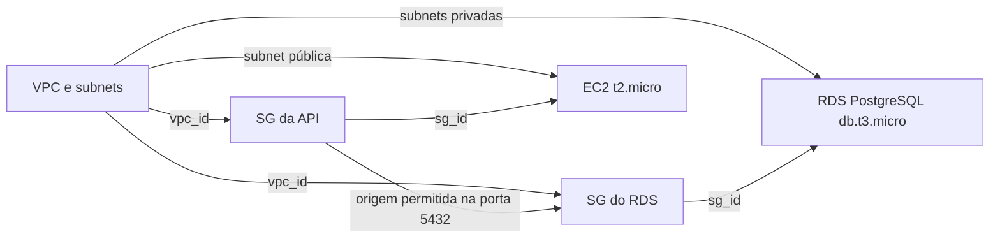

# Aula 06 — Biblioteca de módulos Terraform

Biblioteca reutilizável da TechNova com VPC, Security Groups, EC2 e RDS PostgreSQL.
Dev e staging usam os mesmos módulos locais, com states locais independentes.

## Arquitetura



Cada ambiente contém duas subnets públicas e duas privadas, em us-east-1a e
us-east-1b. Somente as públicas têm rota para o Internet Gateway. Não há NAT
Gateway. O RDS é privado e permite PostgreSQL apenas do SG da API.

| Configuração | Dev | Staging |
|---|---|---|
| VPC | 10.0.0.0/16 | 10.1.0.0/16 |
| Públicas | 10.0.1.0/24, 10.0.2.0/24 | 10.1.1.0/24, 10.1.2.0/24 |
| Privadas | 10.0.3.0/24, 10.0.4.0/24 | 10.1.3.0/24, 10.1.4.0/24 |
| Database | technova_dev | technova_staging |
| Prefixo | technova-dev-* | technova-staging-* |
| EC2 / RDS | t2.micro / db.t3.micro | t2.micro / db.t3.micro |

## Pré-requisitos

- Terraform >= 1.5 e < 2.0; provider hashicorp/aws ~> 5.0, com lockfile por ambiente.
- AWS CLI com credenciais temporárias válidas do AWS Academy Learner Lab.
- Região us-east-1 e Key Pair existente (`vockey` por padrão).
- Senha RDS fornecida por `TF_VAR_db_password`, nunca incluída no Git.

A AMI Amazon Linux 2023 x86_64 é consultada na AWS. O RDS usa PostgreSQL 15.17,
20 GB gp2 cifrados, Single-AZ, sem backup automático nem snapshot final: opções
para laboratório. Todos os recursos que suportam tags recebem Name, Environment,
Project e ManagedBy. A associação de route table não suporta tags.

## Como validar

Na raiz de `aula-06/`, usando Bash:

```bash
aws sts get-caller-identity
read -rsp 'Senha RDS (alfanumérica, mínimo 8 caracteres): ' TF_VAR_db_password
printf '\n'
export TF_VAR_db_password
terraform fmt -check -recursive
for ambiente in dev staging; do
  terraform -chdir="environments/$ambiente" init
  terraform -chdir="environments/$ambiente" validate
  terraform -chdir="environments/$ambiente" plan
done
unset TF_VAR_db_password
```

Os `terraform.tfvars` são versionados porque contêm apenas CIDRs, nomes e subnets,
conforme a estrutura do enunciado. Senhas, states, planos binários e `.terraform/`
são ignorados. Cada ambiente usa seu próprio state; não há backend compartilhado
exigido neste TF.

O TF permite validar somente com `validate` e `plan`. Não é necessário executar
`apply`. Caso opte por provisionar, forneça novamente a senha e execute `terraform
destroy` no mesmo ambiente ao terminar. A nota e o percentual na interface do
AWS Academy devem ser conferidos separadamente; um plano não comprova essa nota.

## Módulos disponíveis

| Módulo | Descrição | Inputs principais | Outputs |
|---|---|---|---|
| vpc | VPC, subnets dinâmicas, IGW e rotas públicas | vpc_cidr, subnets, project_name, environment | vpc_id, public_subnet_ids, private_subnet_ids |
| security-group | Ingress como lista de objetos, egress liberado | name, vpc_id, ingress_rules, project_name, environment | sg_id |
| ec2 | Instância com AMI, subnet e SG configuráveis | instance_name, instance_type, ami_id, subnet_id, security_group_ids, key_name, user_data, project_name, environment | instance_id, public_ip, private_ip |
| rds | PostgreSQL privado e DB Subnet Group | db_name, db_username, db_password, subnet_ids, security_group_ids, instance_class, project_name, environment | db_endpoint, db_name, db_port |

### Módulo `vpc`

**Inputs**

| Nome | Tipo | Obrigatório / padrão | Descrição |
|---|---|---|---|
| vpc_cidr | `string` | Sim | CIDR da VPC. |
| project_name | `string` | Sim | Nome do projeto. |
| environment | `string` | Sim | Nome do ambiente. |
| subnets | `map(object({ cidr = string, az = string, type = string }))` | Sim | Subnets com CIDR, zona e tipo public ou private. |

`subnets`: mapa de objetos `{ cidr = string, az = string, type = string }`; `type` é `public` ou `private`.

**Outputs**

| Nome | Descrição |
|---|---|
| vpc_id | ID da VPC. |
| public_subnet_ids | IDs das subnets públicas em ordem de chave. |
| private_subnet_ids | IDs das subnets privadas em ordem de chave. |

**Exemplo de uso** (dentro de `environments/<ambiente>/`, compondo os módulos):

```hcl
module "vpc" {
  source       = "../../modules/vpc"
  project_name = var.project_name
  environment  = var.environment
  vpc_cidr     = var.vpc_cidr
  subnets      = var.subnets
}
```

### Módulo `security-group`

**Inputs**

| Nome | Tipo | Obrigatório / padrão | Descrição |
|---|---|---|---|
| name | `string` | Sim | Nome do Security Group. |
| vpc_id | `string` | Sim | ID da VPC. |
| ingress_rules | `list(object({ from_port = number, to_port = number, protocol = string, description = string, cidr_blocks = optional(list(string), []), security_groups = optional(list(string), []) }))` | Sim | Regras de entrada por CIDR ou Security Group de origem. |
| project_name | `string` | Sim | Nome do projeto. |
| environment | `string` | Sim | Nome do ambiente. |

Cada regra tem `from_port`, `to_port`, `protocol`, `description` e campos opcionais `cidr_blocks` e `security_groups` (listas vazias por padrão).

**Outputs**

| Nome | Descrição |
|---|---|
| sg_id | ID do Security Group. |

**Exemplo de uso** (dentro de `environments/<ambiente>/`, compondo os módulos):

```hcl
module "rds_sg" {
  source       = "../../modules/security-group"
  name         = "${var.project_name}-${var.environment}-rds-sg"
  project_name = var.project_name
  environment  = var.environment
  vpc_id       = module.vpc.vpc_id
  ingress_rules = [{
    from_port       = 5432
    to_port         = 5432
    protocol        = "tcp"
    description     = "PostgreSQL somente da EC2"
    security_groups = [module.api_sg.sg_id]
  }]
}
```

### Módulo `ec2`

**Inputs**

| Nome | Tipo | Obrigatório / padrão | Descrição |
|---|---|---|---|
| instance_name | `string` | Sim | Nome da instância. |
| instance_type | `string` | "t2.micro" | Tipo EC2. |
| ami_id | `string` | Sim | AMI da instância. |
| subnet_id | `string` | Sim | ID da subnet. |
| security_group_ids | `list(string)` | Sim | Security Groups da instância. |
| key_name | `string` | Sim | Key Pair existente na região. |
| user_data | `string` | null | Script de inicialização opcional. |
| project_name | `string` | Sim | Nome do projeto. |
| environment | `string` | Sim | Nome do ambiente. |

**Outputs**

| Nome | Descrição |
|---|---|
| instance_id | ID da instância. |
| public_ip | IP público da instância. |
| private_ip | IP privado da instância. |

**Exemplo de uso** (dentro de `environments/<ambiente>/`, compondo os módulos):

```hcl
module "api_server" {
  source             = "../../modules/ec2"
  instance_name      = "${var.project_name}-${var.environment}-api"
  project_name       = var.project_name
  environment        = var.environment
  instance_type      = "t2.micro"
  ami_id             = data.aws_ami.amazon_linux.id
  subnet_id          = module.vpc.public_subnet_ids[0]
  security_group_ids = [module.api_sg.sg_id]
  key_name           = var.key_name
}
```

### Módulo `rds`

**Inputs**

| Nome | Tipo | Obrigatório / padrão | Descrição |
|---|---|---|---|
| db_name | `string` | Sim | Nome do database PostgreSQL. |
| db_username | `string` | Sim | Usuário administrador. |
| db_password | `string` (sensitive) | Sim | Senha do banco; fornecer via TF_VAR_db_password. |
| subnet_ids | `list(string)` | Sim | Subnets privadas em pelo menos duas AZs. |
| security_group_ids | `list(string)` | Sim | Security Groups do banco. |
| instance_class | `string` | "db.t3.micro" | Classe RDS. |
| project_name | `string` | Sim | Nome do projeto. |
| environment | `string` | Sim | Nome do ambiente. |

**Outputs**

| Nome | Descrição |
|---|---|
| db_endpoint | Endpoint PostgreSQL com porta. |
| db_name | Nome do database. |
| db_port | Porta PostgreSQL. |

**Exemplo de uso** (dentro de `environments/<ambiente>/`, compondo os módulos):

```hcl
module "database" {
  source             = "../../modules/rds"
  project_name       = var.project_name
  environment        = var.environment
  db_name            = var.db_name
  db_username        = var.db_username
  db_password        = var.db_password
  subnet_ids         = module.vpc.private_subnet_ids
  security_group_ids = [module.rds_sg.sg_id]
  instance_class     = "db.t3.micro"
}
```

## Criar outro ambiente

Copie `environments/dev/` para `environments/test/`, sem copiar `.terraform/` ou
state. Altere `environment = "test"`, `vpc_cidr = "10.2.0.0/16"`, `db_name =
"technova_test"` e os quatro CIDRs para `10.2.1.0/24` até `10.2.4.0/24` no
`terraform.tfvars`. Mantenha as chamadas `../../modules/...`: a biblioteca é a mesma.
Execute `init`, `validate` e `plan` na nova pasta, com a senha em variável de ambiente.

## Referências

- [Enunciado do TF 06](https://github.com/AleTavares/devops_20262/blob/main/aula-06/TF.md)
- [HashiCorp: for_each](https://developer.hashicorp.com/terraform/language/meta-arguments/for_each)
- [Provider AWS: RDS](https://registry.terraform.io/providers/hashicorp/aws/5.100.0/docs/resources/db_instance)
